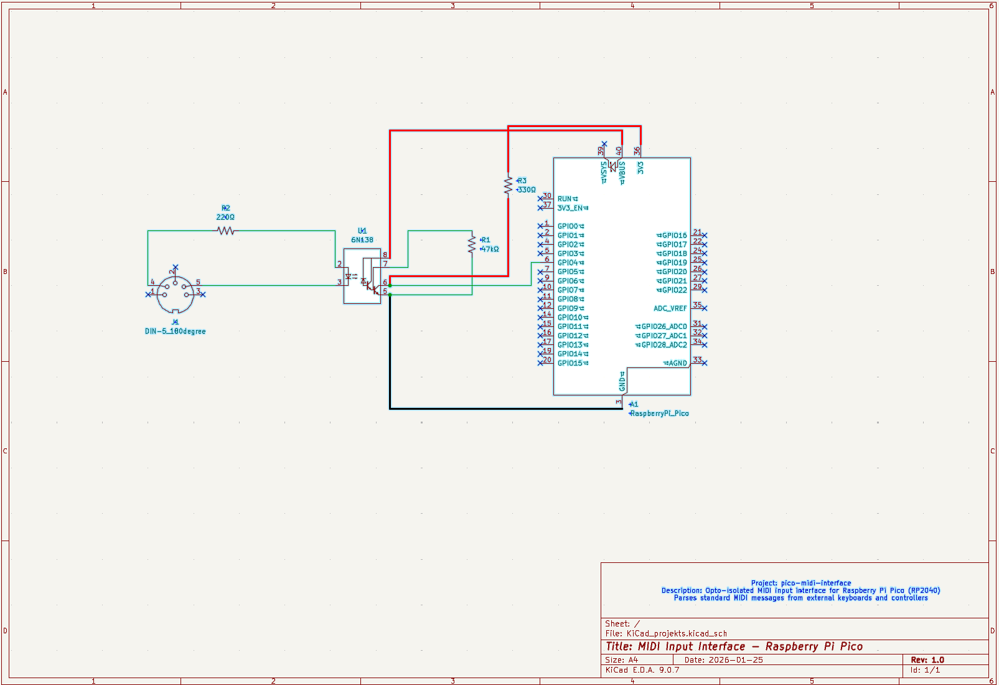

# Components used
- Raspberry Pi Pico W
- USB 2.0 Type-A male to Micro-USB Type-B male cable
- Resistors
  * R1 47kΩ
  * R2 220Ω
  * R3 330Ω
- 6N138
- Jumper wires x5
- 5-pin DIN cable
- 5-pin 180° DIN female PCB mount connector
- Novation Launchkey 37 MK3

# Schematic diagram

# Breadboard connections

